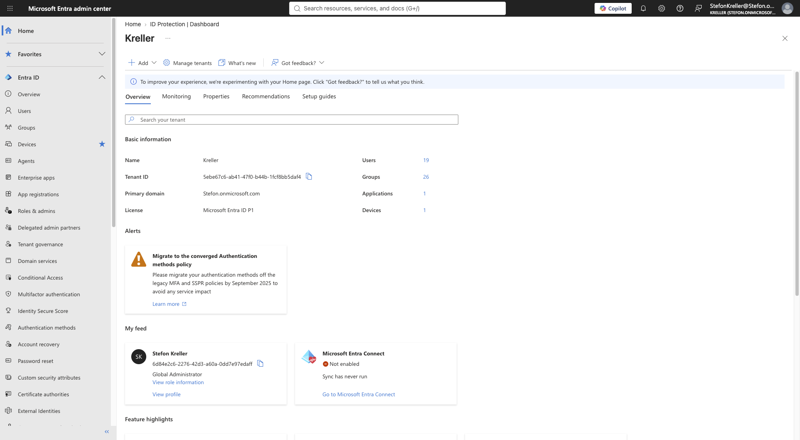
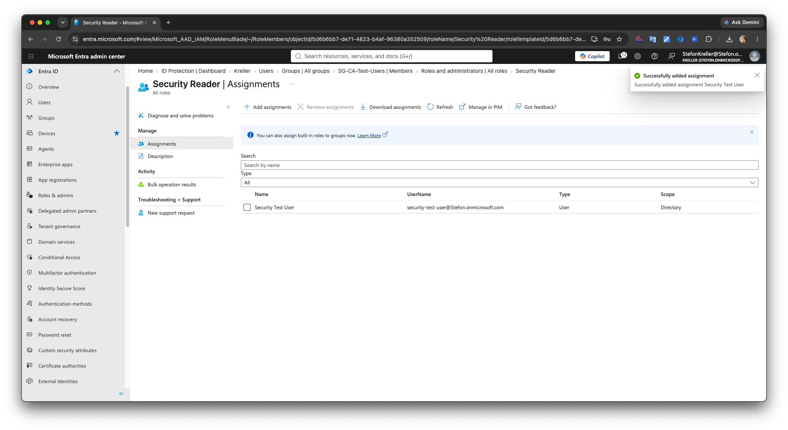

# Microsoft Entra ID IAM & Security Lab


## Overview

This project is a hands-on Microsoft Entra ID Identity and Access
Management (IAM) security lab designed to demonstrate practical cloud
identity administration, authentication security, Conditional Access,
Role-Based Access Control (RBAC), monitoring, and troubleshooting.

The lab simulates common identity and security responsibilities performed
by IT support, Microsoft 365, IAM, cloud support, and security
administrators.

Rather than documenting configuration alone, the project focuses on the
complete administrative workflow:

**Configure → Test → Validate → Investigate → Document**

Conditional Access controls were deployed using a safer staged approach:

**Configure → Report-only → Simulate → Validate → Investigate →
Audit**

## Project Highlights

- Microsoft Entra ID user administration
- Security group administration
- Microsoft Authenticator
- Multifactor Authentication
- MFA number matching
- Conditional Access
- Named locations
- Legacy authentication protection
- Device platform restrictions
- Device code authentication restrictions
- Administrative portal protection
- Role-Based Access Control
- Least-privilege administration
- Sign-in log analysis
- Audit-log investigation
- Authentication troubleshooting
- Conditional Access troubleshooting

---

## Project Architecture

```text
                         Microsoft Entra ID
                                |
        +-----------------------+-----------------------+
        |                       |                       |
     Identities            Authentication            RBAC
        |                       |                       |
   Users / Groups         MFA / Authenticator      Admin Roles
        |                       |                       |
        +-----------------------+-----------------------+
                                |
                       Conditional Access
                                |
         +----------------------+----------------------+
         |              |              |              |
        MFA          Locations       Devices        Auth Flows
         |              |              |              |
         +----------------------+----------------------+
                                |
                         Access Decision
                                |
                +---------------+---------------+
                |                               |
           Sign-In Logs                     Audit Logs
                |                               |
        Authentication Analysis         Change Investigation
---

## Lab Environment

The project was completed in a dedicated Microsoft cloud lab environment
using Microsoft Entra ID.

Administrative work was performed through the Microsoft Entra admin
center.

The environment was structured around separate administrative and test
identities so security controls could be evaluated without unnecessarily
affecting the primary administrator.

| Component | Purpose |
|---|---|
| Microsoft Entra ID | Identity and access management |
| Microsoft Entra Admin Center | Identity/security administration |
| Microsoft Authenticator | MFA registration and authentication |
| Conditional Access | Context-aware access controls |
| Microsoft Entra RBAC | Administrative permission delegation |
| Sign-in Logs | Authentication investigation |
| Audit Logs | Administrative change tracking |
| What If | Conditional Access simulation |

### Environment Evidence



[Read the Environment Setup
documentation](Documentation/01-Environment-Setup.md)

---

## Identity and Group Administration

Dedicated security-lab identities were used for controlled testing.

Test identities simulated both standard users and privileged
administrators.

A dedicated security group was created:

`SG-CA-Test-Users`

The group provided a scalable target for Conditional Access policies
instead of requiring policies to be assigned individually to each test
identity.

### Tasks Completed

- Reviewed Microsoft Entra users
- Used dedicated security test identities
- Created security groups
- Added users to groups
- Verified group membership
- Used group-based Conditional Access targeting
- Separated standard and administrative testing

### Security Lab Test Users


### Conditional Access Test Group


[View all User and Group evidence](Screenshots/Users-Groups/)

[Read the User and Group documentation](Documentation/02-Users-Groups.md)

---

### Block 2 of 6

```markdown
## Multifactor Authentication & Microsoft Authenticator

Microsoft Authenticator was configured and tested as part of the lab's
authentication-security implementation.

A test identity completed authentication registration and MFA validation.

Number matching was also tested to demonstrate stronger MFA verification.

### Authentication Tasks

- Reviewed authentication-method configuration
- Enabled Microsoft Authenticator
- Completed security-information registration
- Registered Microsoft Authenticator
- Tested MFA
- Tested number matching
- Verified successful registration
- Investigated authentication results

### Microsoft Authenticator Configuration


### MFA Number Matching


### Authenticator Registration Success


[View Authentication evidence](Screenshots/Authentication/)

[View MFA evidence](Screenshots/MFA/)

[Read the MFA and Authentication
documentation](Documentation/03-MFA-Authentication.md)

---

## Conditional Access

Conditional Access was the primary security component of this project.

Multiple policies were created to demonstrate identity-based, role-based,
location-based, device-based, application-based, and
authentication-flow-based access controls.

Policies remained in **Report-only** mode during testing.

This provided a safer way to evaluate policy behavior without risking
accidental administrative lockout.

### Conditional Access Policies

| Policy | Security Objective | Mode |
|---|---|---|
| CA-Require-MFA-and-Compliant-Device | Require MFA/device security |
Report-only |
| CA001-Require-MFA-Test-Users | Require MFA for test users | Report-only
|
| CA002-Block-Legacy-Authentication | Block legacy authentication |
Report-only |
| CA003-Require-MFA-Admins | Require MFA for administrators | Report-only
|
| CA004-Block-Access-Outside-Trusted-Location | Restrict access by
location | Report-only |
| CA005-Block-Unsupported-Device-Platforms | Restrict unsupported
platforms | Report-only |
| CA006-Require-MFA-Admin-Portals | Protect administrative resources |
Report-only |
| CA007-Block-Device-Code-Authentication | Restrict device code
authentication | Report-only |

### Final Conditional Access Policy Overview


This provides centralized evidence of the Conditional Access controls
created during the lab.

---

## MFA Enforcement

Conditional Access was configured to require MFA for selected test
identities.

### CA001 — Require MFA for Test Users


The policy was evaluated in Report-only mode before potential enforcement.

---

## Legacy Authentication Protection

Legacy authentication protocols can weaken modern identity-security
controls.

A Conditional Access policy was configured to block legacy authentication
clients.

### CA002 — Block Legacy Authentication


This demonstrates how organizations can reduce exposure to authentication
methods that do not fully support modern security controls.

---

## Administrative MFA

Privileged identities represent high-value targets.

Conditional Access was configured to require MFA for selected Microsoft
Entra administrative roles.

### CA003 — Require MFA for Administrators


This adds an additional authentication layer around privileged
administration.

---
## Named Locations & Network-Based Access

A named location was created to represent a trusted corporate network.

The documentation-only TEST-NET range used for the lab was:

`203.0.113.0/24`

### Trusted Corporate Network


A Conditional Access policy was then configured to block access when
authentication originated outside the trusted location.

### CA004 — Block Access Outside Trusted Location


---

## Conditional Access What If Testing

The Microsoft Entra Conditional Access **What If** tool was used to
simulate authentication scenarios before policy enforcement.

Policy behavior was evaluated using conditions such as:

- User
- Group
- Application
- Location
- Device platform
- Authentication flow

### Outside Trusted Location


The simulation demonstrated that CA004 would apply when authentication
originated outside the trusted location.

### Trusted Location Exclusion


Testing from the simulated trusted network demonstrated that the location
exclusion prevented CA004 from applying.

Testing both positive and negative conditions provided stronger validation
than simply creating the policy.

---

## Device Platform Security

Conditional Access was configured to evaluate device-platform conditions.

### CA005 — Block Unsupported Device Platforms


What If testing was used to validate expected behavior before enforcement.

---

## Microsoft Administrative Portal Protection

Administrative portals provide access to sensitive cloud configuration.

CA006 was created to require MFA for Microsoft administrative resources.

### CA006 — Require MFA for Admin Portals


This demonstrates additional protection around privileged cloud
administration.

---

## Device Code Authentication Protection

Device code authentication is useful for devices with limited input
capabilities, but the authentication flow can present security risks if
abused.

CA007 was created to block device code authentication for lab test
identities.

### CA007 — Block Device Code Authentication


### What If Validation


The What If evaluation confirmed that CA007 matched the simulated device
code authentication flow and produced the expected **Block access**
result.

[View all Conditional Access evidence](Screenshots/Conditional-Access/)

[Read the complete Conditional Access
documentation](Documentation/04-Conditional-Access.md)

---
## Role-Based Access Control

Microsoft Entra directory roles were used to demonstrate least-privilege
administration.

Rather than granting broad administrative access to every account,
specialized roles were assigned and tested.

### Roles Tested

- Conditional Access Administrator
- Helpdesk Administrator
- Security Reader

### Conditional Access Administrator


This role was used for delegated Conditional Access administration.

### Helpdesk Administrator


This role represents limited IT support responsibilities without requiring
broad tenant administration.

### Security Reader



This role provides security visibility without configuration privileges.

---

## Least-Privilege Validation

Role assignment alone does not prove that least privilege is functioning.

The delegated Conditional Access administrator was tested to verify both
allowed and restricted administrative functionality.

### Conditional Access Access


### Limited Administrative Permissions


This demonstrated practical administrative separation rather than simply
documenting role assignments.

[View all RBAC evidence](Screenshots/RBAC/)

[Read the RBAC and Permissions
documentation](Documentation/05-RBAC-Permissions.md)

---

## Sign-In Monitoring

Microsoft Entra sign-in logs were used to investigate authentication
activity.

Sign-in analysis included reviewing:

- User identity
- Application
- Authentication status
- MFA requirements
- Conditional Access results
- Authentication interruptions

### Successful MFA Sign-In


One successful authentication demonstrated that the MFA requirement had
been satisfied by an MFA claim associated with the authentication session.

---

## Report-Only Policy Validation

Conditional Access Report-only mode allowed policy behavior to be observed
without actively enforcing the access decision.

### CA001 Report-Only Evaluation


### CA001 Report-Only Success


This staged deployment approach reduces the risk of accidental user or
administrator lockout.

---

## Audit Log Investigation

Microsoft Entra audit logs were used to validate administrative changes.

The audit trail provided evidence that Conditional Access configuration
changes were recorded.

### Directory Audit Activity


### CA007 Policy Creation


### CA007 Modified Properties


This demonstrates how administrators can correlate configuration activity
with Microsoft Entra audit records.

---
## Identity Security Strategy

The controls implemented throughout this project form a layered
identity-security model.

```text
Identity
   |
   v
Strong Authentication
   |
   v
MFA / Microsoft Authenticator
   |
   v
Least-Privilege RBAC
   |
   v
Conditional Access
   |
   +---- Identity
   +---- Application
   +---- Location
   +---- Device Platform
   +---- Authentication Flow
   |
   v
Access Decision
   |
   v
Sign-In Monitoring
   |
   v
Audit & Investigation
```

The goal is not to rely on a single security mechanism.

Instead, identity protection is strengthened through multiple overlapping
controls.

[Read the Identity Security
documentation](Documentation/06-Identity-Security.md)

---

## Troubleshooting

Troubleshooting was treated as a core component of the project rather than
documenting only successful configurations.

The troubleshooting workflow was:

**Identify → Reproduce → Investigate → Isolate → Correct → Validate
→ Document**

### Scenarios Investigated

- MFA registration session expiration
- Expired password sign-in interruption
- Conditional Access policy matching
- Conditional Access policy exclusions
- Group membership validation
- MFA claims
- RBAC permissions
- Sign-in results
- Audit events
- Licensing limitations

### MFA Registration Session Expired


### Interrupted Sign-In / Expired Password


### Conditional Access Policies Not Applied


These scenarios demonstrate using Microsoft Entra evidence and diagnostic
tools to determine the cause of identity and access issues rather than
assuming the source of the problem.

[Read the complete Troubleshooting
documentation](Documentation/07-Troubleshooting.md)

---

## Licensing Limitation Identified

Risk-based Conditional Access was investigated during the project.

The lab tenant did not expose the required **Sign-in risk** condition for
the planned risk-based Conditional Access policy.

Instead of representing an unsupported feature as successfully configured,
the limitation was documented and the project continued using supported
Conditional Access scenarios.

This demonstrates an important real-world cloud administration skill:

**Distinguishing configuration problems from licensing and
feature-availability limitations.**

---

## Security Practices Demonstrated

### Defense in Depth

Multiple security controls were combined rather than relying on passwords
alone.

### Least Privilege

Administrative permissions were separated using specialized Microsoft
Entra directory roles.

### Strong Authentication

MFA and Microsoft Authenticator were configured and tested.

### Controlled Deployment

Conditional Access policies remained in Report-only mode while being
evaluated.

### Positive and Negative Testing

Policies were tested under conditions where they should apply and
conditions where they should not apply.

### Monitoring

Sign-in logs were used to validate authentication behavior and investigate
access events.

### Auditing

Audit logs were used to verify administrative changes and review policy
activity.

### Troubleshooting

Authentication and access issues were investigated using Microsoft Entra
diagnostic information and controlled testing.

---
## Skills Demonstrated

### Identity & Access Management

- Microsoft Entra ID
- User administration
- Security group administration
- Group membership management
- IAM administration
- Identity security
- Access management

### Authentication

- Multifactor Authentication
- Microsoft Authenticator
- MFA number matching
- Authentication methods
- Authentication registration
- Authentication troubleshooting

### Conditional Access

- User and group targeting
- Administrative-role targeting
- Application targeting
- Named locations
- Device platform conditions
- Authentication flow conditions
- Block access controls
- MFA grant controls
- Report-only deployment
- What If testing
- Policy validation

### Administrative Security

- Microsoft Entra RBAC
- Conditional Access Administrator
- Helpdesk Administrator
- Security Reader
- Least privilege
- Administrative separation
- Permission validation

### Monitoring & Troubleshooting

- Sign-in log analysis
- Audit-log investigation
- Conditional Access troubleshooting
- MFA troubleshooting
- Password troubleshooting
- Group membership validation
- RBAC troubleshooting
- Licensing investigation
- Root-cause analysis

---

## Documentation

Detailed technical documentation is available for each major section of
the project:

1. [Environment Setup](Documentation/01-Environment-Setup.md)
2. [Users & Groups](Documentation/02-Users-Groups.md)
3. [MFA & Authentication](Documentation/03-MFA-Authentication.md)
4. [Conditional Access](Documentation/04-Conditional-Access.md)
5. [RBAC & Permissions](Documentation/05-RBAC-Permissions.md)
6. [Identity Security](Documentation/06-Identity-Security.md)
7. [Troubleshooting](Documentation/07-Troubleshooting.md)

---

## Repository Structure

```text
Microsoft-Entra-ID-IAM-Security-Lab/
|
├── README.md
|
├── Documentation/
│   ├── 01-Environment-Setup.md
│   ├── 02-Users-Groups.md
│   ├── 03-MFA-Authentication.md
│   ├── 04-Conditional-Access.md
│   ├── 05-RBAC-Permissions.md
│   ├── 06-Identity-Security.md
│   └── 07-Troubleshooting.md
|
├── Screenshots/
│   ├── Authentication/
│   ├── Conditional-Access/
│   ├── Entra-ID/
│   ├── MFA/
│   ├── RBAC/
│   ├── Troubleshooting/
│   └── Users-Groups/
|
├── Help-Desk-Tickets/
|
└── Diagrams/
```

---

## Key Takeaways

This project demonstrates that identity administration involves much more
than creating users and resetting passwords.

A secure Microsoft Entra environment requires administrators to understand
how identity, authentication, authorization, access policies, monitoring,
and auditing work together.

Key lessons from the project include:

- MFA provides an important defense against password compromise.
- Conditional Access allows authentication context to influence access
decisions.
- Report-only deployment reduces the risk associated with new access
policies.
- What If testing provides a controlled way to validate policy logic.
- Named locations can support location-aware security decisions.
- Legacy authentication should be restricted where possible.
- Privileged administrative access should receive stronger protection.
- RBAC helps enforce least privilege.
- Sign-in logs provide critical authentication evidence.
- Audit logs provide accountability for administrative changes.
- Licensing can determine which identity-security capabilities are
available.
- Effective troubleshooting requires validating the complete
authentication path rather than assuming a single cause.

---

## Portfolio Purpose

This repository was created as a practical demonstration of Microsoft
cloud identity and security administration.

It is intended to demonstrate hands-on skills relevant to roles such as:

- IT Support Specialist
- Help Desk Technician
- Microsoft 365 Support Specialist
- Microsoft Entra ID Administrator
- Identity and Access Management Analyst
- Cloud Support Specialist
- Junior Systems Administrator
- Security Support Analyst

The project emphasizes not only configuration, but also **testing,
validation, troubleshooting, monitoring, security analysis, and technical
documentation**.

---

## Project Status

**Complete**

The lab includes configured identity-security controls, validation
testing, screenshots, detailed documentation, and troubleshooting
evidence.
